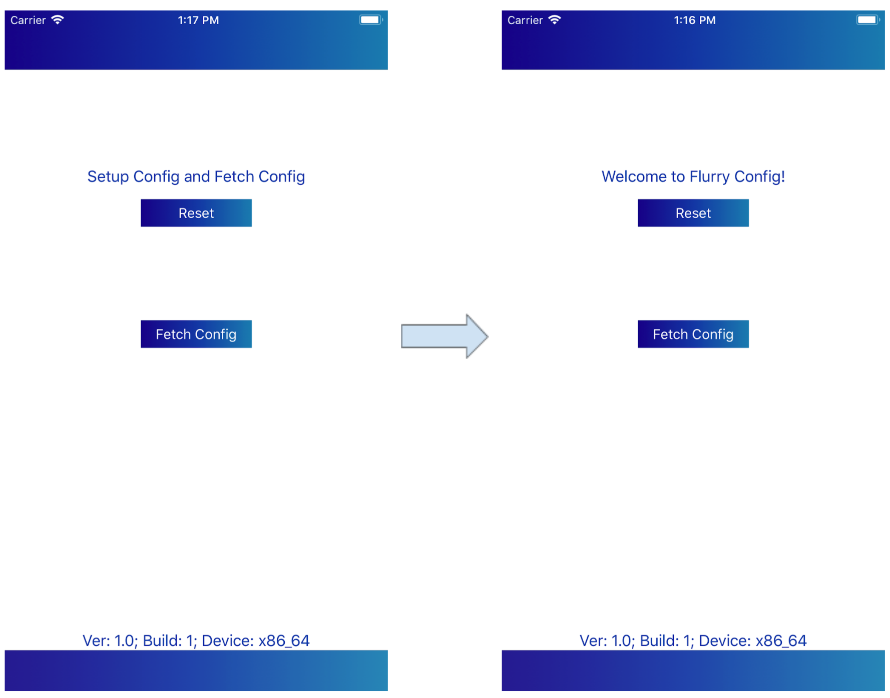
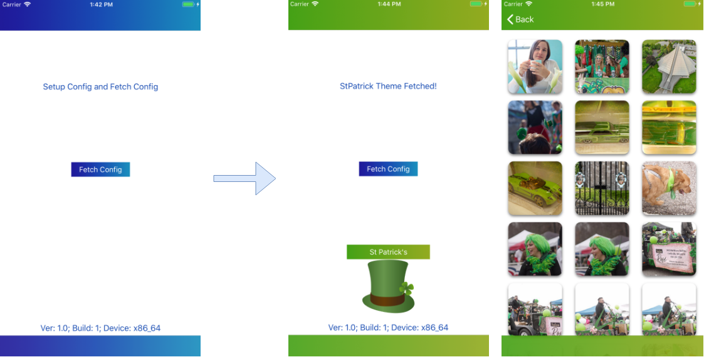
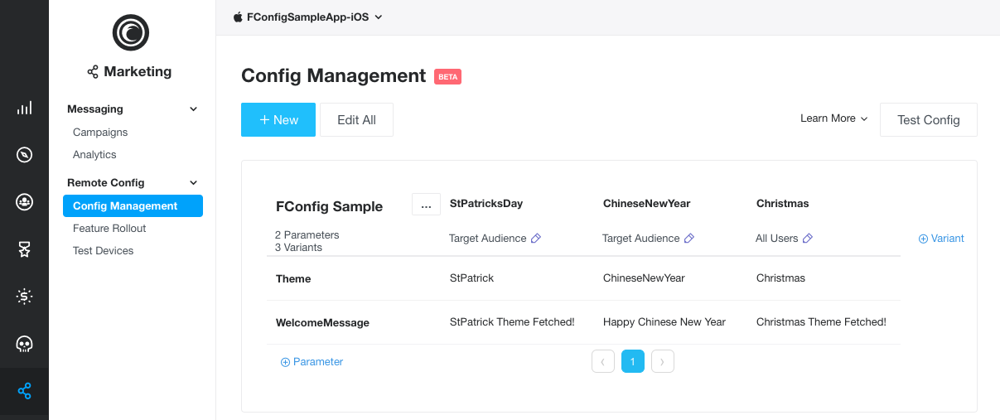

Flurry Remote Config Sample App iOS
==============================

_Flurry Remote Config is a new Beta product offered from Flurry.
We’re currently accepting requests for the invite only Beta.
If you would like to be included in the Beta, please email support@flurry.com._

This Sample app guide walks you through the steps of integrating Flurry Config into your iOS app.

Introduction
------------

The traditional app development process involves compiling an app, uploading to
an app store and releasing it to users. In order to move more quickly
Flurry Remote Config can enable the ability to tune the app experience after
it has shipped via a technology called Remote Configuration. Found a typo,
forgot to change button color or want to enable/ disable app features;
making these changes is simply changing values on Flurry Remote Config UI.
Product Managers, Growth Managers and non-technical team members can safely
make such changes. No need to wait for next app version release!

Create a project for Flurry
---------------

If you already have a Flurry project for Analytics or Ads, you may skip these steps.

Set up your project using the instructions provided in
[Integrate Flurry SDK for iOS](https://developer.yahoo.com/flurry/docs/integrateflurry/ios/).

1. Create an App and Get Your API Key.
2. Add the following dependency to your app's [CocoaPod](https://cocoapods.org/), then do `pod install`.
```ruby
    pod 'Flurry-iOS-SDK/FlurrySDK' #Analytics Pod
    pod 'Flurry-iOS-SDK/FlurryConfig' #Config Pod
    pod 'Flurry-iOS-SDK/FlurryAds' #Advertising Pod (requires Analytics)
```
3. Initialize the Flurry SDK with your project’s API key.
```objc
    [Flurry startSession:YOUR_FLURRY_API_KEY];
```

Setup Flurry Config for project
---------------

The purpose of this section is to demonstrate the capabilities of Flurry Config for
remote configuration as well as provide a brief tutorial on the use of
the Flurry Remote Config APIs.

### Build and run the Flurry Config sample app iOS

1. Download the [Flurry Config iOS sample code](https://git.corp.yahoo.com/yuningj/FlurryConfigSample).
	`git clone https://git.corp.yahoo.com/yuningj/FlurryConfigSample`
2. Open the Xcode workspace in the folder of git clone.
3. Build and run the sample app.
> You will need to replace with your own created Flurry API Key in your sample app
  in order to modify the config data.

Flurry Config SDK APIs
--------------

* **Fetch**: Retrieve the config data from the Flurry server.
* **Activate**: Apply the most recent config data received from the server.
* **Register/Unregister Listener**: Register and unregister a listener for the state of
  fetching and activating.
* **Getters**: Retrieves values from the active configuration.


Flurry Config Concepts
--------------

* **Cache**: Flurry Config caches values locally after the successful fetch.
  Before you activating the new data received by the server, the get methods
  will retrieve values from the cache.
* **Default Values**: With each getter, there is a default value that will be passed in.
  In some circumstances it is possible that a config will not be available. Providing
  a default allows Flurry Config to have a hard-coded fallback to ensure that the app
  is always in usable state. Example: user installs the app, but launches it when device
  is not connected to cellular network/ internet. It is also useful for testing.
* **Data Parsing**: All config values are stored as strings but for convenience,
  several getters are provided to allow the developer to interact with
  the Remote Config UI in an easier manner.

### Navigate Sample Codes
_In code base, search for `//Step` in the sample app project._

* **Step 1**: Initialize Flurry SDK with API key of your app. `(AppDelegate.m)`
```objc
    //Step 1
    [Flurry startSession:YOUR_FLURRY_API_KEY];
```

* **Step 2**: Register your class as a listener from Flurry Config. `(LoaderViewController.m)`
```objc
    //Step 2
    [[FConfig sharedInstance] registerObserver:self withExecutionQueue:dispatch_queue_create("dispatch_queue_#1", 0)];
```

* **Step 3**: Fetch config. `(LoaderViewController.m)`
```objc
    //Step 3
    [[FConfig sharedInstance] fetchConfig];
```

* **Step 4**: Activate fetched config. `(LoaderViewController.m)`
```objc
    //Step 4
    [[FConfig sharedInstance] activateConfig];
```

* **Step 5**: implement callback functions. `(LoaderViewController.m)`
```objc
    //Step 5
    - (void) fetchComplete
    {
        self.welcomeLabelText = [[FConfig sharedInstance] getStringForKey:@"WelcomeMessage" withDefault:@"Setup Config and Fetch Config"];
    }
    - (void) fetchCompleteNoChange {}
    - (void) fetchFail {}
    - (void) activationComplete {}
```

These callback functions are defined in `@protocol FConfigObserver`. This is an observer pattern and is **NOT** a delegate. This means that multiple classes can observe after registering with the FConfig#registerObserver method.


Simple Sample: Welcome message
--------------

This config sample provides an example of using Flurry Config to define the welcome message
of the sample app. Before running the sample, you should set up a Flurry Config project.
From [Flurry Analytics](https://y.flurry.com), navigate to the Flurry Remote Config UI
by clicking on the **Marketing** tab and **Remote Config** on the sidebar. Follow the
instructions to Set up a Flurry Config Project with the following parameters:

| Parameter key      | Example value             | Notes:                                    |
|--------------------|---------------------------|-------------------------------------------|
| WelcomeMessage     | Welcome to Flurry Config! | Change to use a different welcome message |

After configuring your project, run the sample app to see the welcome message “Welcome to Flurry Config!” (Or whatever value you put in remote config). You can use buttons “Fetch Config” to fetch config from server.




Advanced Sample: UI theme & App content
--------------

Flurry Config allows you to deliver different UI and different content to different users. In this example, we show you how app could change its UI style, View flows and fetching query for different sets of photos from Flickr APIs, with the help of remote config. After setting up “Theme” key value, click “Fetch Config” button.

| Parameter key      | Example values            |
|--------------------|---------------------------|
| Theme              | Christmas		 |
|		     | ChineseNewYear		 |
|		     | StPatrick		 |





#### Config Web Portal


#### Caching and Activating config

Flurry Config caches values locally after the successful fetch. Before activating the new data received by the server, the available `get` methods will retrieve values from the caches.
In the sample app, `activateConfig` is called in the callback so that whenever `fetchComplete`, it’s automatically activated. However you can hold on to it and activate anytime you want. In that case, before you activate the newly fetched config, config values would be retrieved through `getStringForKey:withDefault:` in the stale cached config. 

Support
-------

- [Flurry Developer Support Site](https://developer.yahoo.com/flurry/docs/)

License
-------

Copyright 2018 Oath Inc.

Licensed under the Apache License, Version 2.0 (the "License");
you may not use this file except in compliance with the License.
You may obtain a copy of the License at

  http://www.apache.org/licenses/LICENSE-2.0

Unless required by applicable law or agreed to in writing, software
distributed under the License is distributed on an "AS IS" BASIS,
WITHOUT WARRANTIES OR CONDITIONS OF ANY KIND, either express or implied.
See the License for the specific language governing permissions and
limitations under the License.
